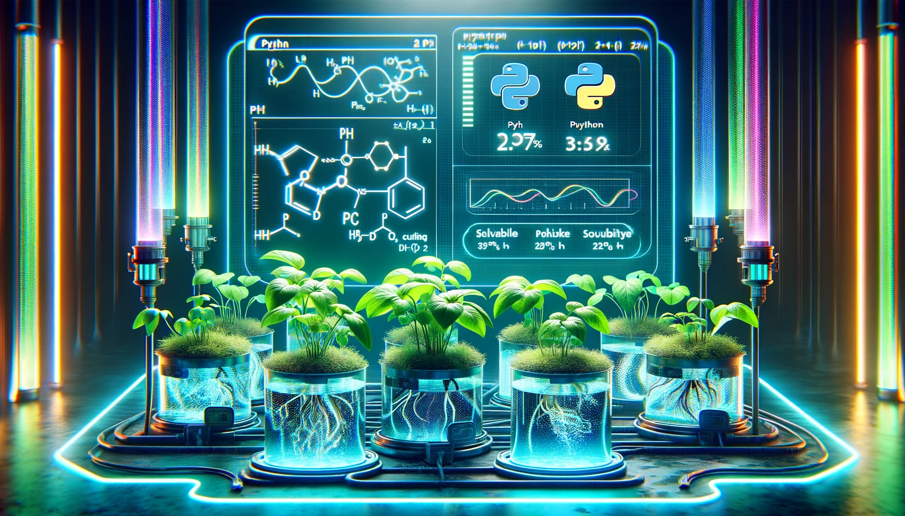

<h1 align="center">
Project Hydroponic simulation
</h1>

<br>

This python package aims to provide some basic tools to simulate hydroponic plant growing.🌱 Hydroponics is a farming method where plants grow without soil and instead use a solution containing the required mineral nutriments.👨‍🌾 This technique is already widely used because it is more efficient in water usage and is in development for farming on mars.🪐🚀

In particular, this package allows you to simulate the concentration of minerals and the pH of hydroponic solutions, determine the pH and check the solubility among others.
See the "Basic Usage" section below and "example.ipynb" document for further examples and explainantions of the package.

Also see the Githubwebpages associated with this project to see the full documentation: [hydroponics](https://nilstheeten.github.io/Project_ppchem/index.html).

Learn more about hydropics with the following links: 
 - [Wikipedia](https://en.wikipedia.org/wiki/Hydroponics#:~:text=Hydroponics%20is%20a%20type%20of,solutions%20in%20an%20artificial%20environment)
 - [USDA](https://www.nal.usda.gov/farms-and-agricultural-production-systems/hydroponics)
 - [NASA](https://www.nasa.gov/science-research/nasa-plant-researchers-explore-question-of-deep-space-food-crops/)

<br>

## 0. Usage 🔥

```python
import hydroponics as hp

plant_name = "Tomato"
required_nutriments = {"Na+": 0.1, "NO3(-)": 0.5, "K+": 0.2} #minerals needed by the plant
solution = {"Na+": 0.2, "NO3(-)": 0.6, "K+": 0.3} #composition of the solution {"ion_name":conc. [g/L]}
analysed_ions = ["Na+", "NO3(-)", "K+"] #ions for which the conc. will be analysed
volume = 2 #L
growth_time = 20 #days
forbidden_ions = ["Cl-"] #ions you don't want in the solution

# Generate an awsome simulation report (PDF)
hp.generate_report(plant_name, required_nutriments, growth_time, analysed_ions, solution, volume, forbidden_ions = forbidden_ions)

```

This usage example shows how to quickly use the package's main functionality: `generate_report` that will provide a lot of essential informations of the simulation. 📝

<br>

## 1. Installation 👩‍💻

 > Everything is just one pip install away - philippe schwaller
<br>

The following *pip command* can be used to install the python package. The package was made with python 3.10
```
pip -m install better_hydroponics
```
  
Be aware, the package uses the following dependencies:
 * Numpy (1.26.4)
 * Pandas (2.2.2)
 * matplotlib (3.8.4)
 * sympy (1.12)
 * openpyxl (3.1.2)

Please install the dependencies with their according `pip install` commands in the right environment.

<br>

## 2. Basic Usage  
The package uses python dictionaries to store the concentration of the different salts/ion in the solution. By default concentrations are given in [g/L]. However different functions exist to convert g/L to mol/L and inversly.

Start by importing the package:

```python
import hydroponics as hp
```

To determine the quantity of each salt to add to the solution to obain the desired concentration of each ion one can use the `make_solution` function. This function checks the solubility of the salt. 🧑‍🔬

```python
ion_composition = {"K+":0.1, "Cl-": 0.3, "H2PO4(-)":0.5, "Ca(2+)":0.4} #desired concentrations in [g/L]
volume = 10 #L
forbidden_ions = ["Li+", "SO4(2-)"]

salts_to_add = hp.make_solution(ion_composition, volume, forbidden_ions)
print(salts_to_add)

```

One can visualise the evolution of the concentration of the ions as the plant grows with the `plot_graph` function.

```python
#Define the variables
solution = {"Na+": 0.2, "NO3(-)": 0.6, "K+": 0.3} #composition of the solution {"ion_name":conc. [g/L]}
required_nutriments = {"Na+": 0.1, "NO3(-)": 0.5, "K+": 0.2} #minerals needed by the plant
growth_time = 20 #days
volume = 5 #L

#plot a figure that shows the concentration of ions as a function of time.
#The figure is directly downloaded in the current directory.
hp.plot_graph(solution, "ion", required_nutriments, growth_time, volume)

```

One can determine the pH of the solution given the concentration  of the ions with the `pH_approximation` function:

```python
solution = {"K+":0.1, "Cl-": 0.3, "H2PO4(-)":0.5, "Ca(2+)":0.4}
temperature = 25 #°C
pH = hp.pH_approximation(solution, temperature)
print(pH)
```
<br>

See the "tutorial.ipynb" notebook for more complete examples.

Or visit [hydroponics](https://nilstheeten.github.io/Project_ppchem/index.html) to see the full documentation of the package.

<br>

## 3. Datasets  

This package uses data from the PRIF17 ([link](https://www.agroscope.admin.ch/agroscope/en/home/topics/plant-production/field-crops/Pflanzenernaehrung/grud.html)) and the wikipedia page about solubility ([wiki](https://en.wikipedia.org/wiki/Solubility_table)).

Accuracy of the results of the package are not guaranteed.

Some solutions and plant compositions are predefined (bell pepper 🫑, cucumber 🥒 and eggplant 🍆), please define a new dict or complete the excel file to use other solutions and new plants.


<br>

## 4. Licence and References  
This package is under MIT license.

Please click on the MIT sign for further information


